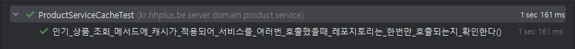

# 캐시
캐시는 자주 사용되는 데이터나 값을 미리 복사해 놓는 임시 저장소이다. 
캐시는 저장 공간이 작고 비용이 비싼 대신 빠른 성능을 제공한다. 
주로 다수가 조회하는 기능에서 사용된다.

## 동작 방식
캐시의 동작 방식은 사용자가 데이터를 요청하면 애플리케이션이 먼저 캐시를 확인한다.
캐시에 데이터가 있으면(Cache Hit) 즉시 반환하고, 캐시에 데이터가 없으면(Cache Miss) DB에서 가져온 후, 캐시에 저장하고 반환한다.

## 장점
- 데이터를 디스크가 아닌 메모리에 적재하여 빠른 데이터 조회를 가능하게 한다.
- 동일한 조회 요청이 반복될 때, DB를 거치지 않고 메모리에서 데이터를 반환하여 DB 부하를 줄이고 응답 속도를 향상시킨다.
## 단점
- 메모리 사용량이 증가하여 리소스 관리가 어려울 수 있다.
- 데이터 일관성을 유지하기 어려우며, 캐시된 데이터와 실제 데이터가 불일치할 가능성이 있다.
- 캐시가 만료될 경우 초기 조회 시 DB 부하가 집중될 위험이 있다.

## 로컬 캐시와 글로벌 캐시

### 로컬 캐시
애플리케이션 내부에서 실행되는 프로세스의 메모리(RAM)에 데이터를 저장하는 방식이다. 
주로 애플리케이션이 실행되는 서버의 RAM을 활용하여 데이터에 빠르게 접근할 수 있다.</br>

- **장점**
    - 서버 내부에서 작동하므로 속도가 빠르다.
    - 네트워크 트래픽 감소 효과가 있다.
- **단점**
    - 서버 간 캐시 데이터의 일관성을 유지하기 어렵다.
    - 메모리 사용량 증가로 인해 OOM(Out of Memory) 문제가 발생할 수 있다.<br>
`OOM(Out of Memory) 문제는 시스템의 가용 메모리가 부족하여 애플리케이션이 정상적으로 실행되지 못하는 현상을 의미한다`

### 글로벌 캐시
여러 서버에서 별도의 캐시 서버(예: Redis)에 접근하여 캐시를 공유하는 방식이다.

- **장점**
    - 서버 간 데이터 공유가 가능하며, 새로운 서버 추가 시 캐시를 새로 채울 필요가 없다.
    - 데이터 일관성을 유지하기 용이하다.
- **단점**
    - 네트워크 트래픽 증가로 인해 로컬 캐시보다 속도가 느릴 수 있다.
    - 별도의 캐시 인프라 관리 비용이 발생한다.

## Redis 캐싱 전략

### Cache-Aside (Look-Aside)
애플리케이션이 캐시에서 데이터를 먼저 조회한 후, 존재하지 않을 경우 DB에서 가져와 캐시에 저장한 후 반환하는 방식이다.

- **장점**
    - 데이터 일관성을 쉽게 유지할 수 있다.
    - 캐시 장애 시에도 DB에서 데이터를 조회할 수 있어 서비스 지속성이 높다.
- **단점**
    - 첫 조회 시 항상 DB를 거쳐야 하므로 초기 부하가 발생할 수 있다.
    - 쓰기 연산 시 캐시를 갱신하지 않으므로 수동으로 갱신해야 한다.

### Read-Through
모든 조회 요청이 캐시를 통해 이루어지며, 캐시에 데이터가 없을 경우 캐시가 DB에서 데이터를 자동으로 가져와 저장한 후 반환하는 방식이다.

- **장점**
    - 애플리케이션이 캐시의 존재를 신경 쓰지 않고 일관된 방식으로 데이터를 조회할 수 있다.
    - 캐시가 자동으로 DB를 조회하여 관리한다.
- **단점**
    - 캐시 계층이 무거워질 수 있다.
    - DB 데이터 변경 시 캐시의 일관성을 유지하기 어렵다.

### Write-Through
쓰기 요청이 캐시를 통해 이루어지며, 캐시가 자동으로 DB에 반영하는 방식이다.

- **장점**
    - 항상 최신의 데이터가 캐시에 존재하므로 데이터 일관성이 유지된다.
- **단점**
    - 쓰기 연산이 느릴 수 있으며, 쓰기 부하가 증가하면 캐시의 부담이 커진다.

### Write-Behind
쓰기 요청이 캐시에 먼저 저장되고, 일정 시간 후 배치로 DB에 반영되는 방식이다.

- **장점**
    - DB 저장을 지연 처리하므로 쓰기 속도가 빠르다.
    - 대량의 데이터 업데이트 시 성능 최적화가 가능하다.
- **단점**
    - 캐시 장애 시 데이터 유실 가능성이 있다.
    - DB와 데이터 일관성이 깨질 위험이 있다.

### Write-Around
쓰기 요청이 캐시를 거치지 않고 직접 DB에 반영되며, 이후 캐시가 필요할 때만 데이터가 저장되는 방식이다.

- **장점**
    - 캐시에 불필요한 데이터가 저장되는 것을 방지할 수 있다.
    - 읽기 요청이 적고 쓰기 요청이 많은 경우 적합하다.
- **단점**
    - 첫 조회 시 캐시 미스(Cache Miss)가 발생하여 응답 속도가 느릴 수 있다.

## 캐시 만료 전략

### TTL(Time-To-Live)
캐시에 저장된 데이터가 일정 시간이 지나면 자동으로 삭제되는 방식이다.

- **장점**
    - 오래된 데이터가 유지되지 않으므로 데이터 일관성을 높일 수 있다.
    - 불필요한 데이터가 제거되어 메모리 효율이 향상된다.
- **단점**
    - 특정 시간에 트래픽이 몰릴 경우 동시 만료로 인해 캐시 스탬피드(Cache Stampede) 현상이 발생할 수 있다.
    - 데이터 갱신이 필요할 경우 TTL 만료 전 수동으로 삭제해야 한다.

### Eviction(삭제 정책)
캐시의 메모리 공간이 가득 찼을 때 특정 정책에 따라 데이터를 삭제하는 방식이다.

- **정책 종류**
    - **LRU(Least Recently Used):** 가장 오랫동안 사용되지 않은 데이터를 제거하는 방식이다.
    - **LFU(Least Frequently Used):** 사용 빈도가 가장 낮은 데이터를 제거하는 방식이다.
    - **FIFO(First-In, First-Out):** 먼저 저장된 데이터를 먼저 삭제하는 방식이다.

- **장점**
    - 캐시 공간을 효율적으로 관리할 수 있다.
    - 자주 사용되는 데이터의 보존이 가능하다.
- **단점**
    - 잘못된 정책을 선택하면 중요한 데이터가 삭제될 가능성이 있다.
    - LRU와 LFU는 관리 비용이 추가로 발생할 수 있다.

## 캐시 스탬피드 현상과 해결 방법

### 캐시 스탬피드(Cache Stampede)
캐시가 동시에 만료되어 새로운 캐시를 생성하는 동안 DB에 부하가 몰려 성능 저하 또는 시스템 장애가 발생하는 현상이다.

### 해결 방법
### 1. TTL 분산 (TTL Randomization)
   TTL(Time To Live) 값을 랜덤하게 설정하여 캐시 만료 시간을 분산시키는 방법이다. 이를 통해 동시에 캐시를 재생성하려는 요청이 줄어든다.

장점:

요청이 동시에 발생할 확률이 줄어들어 캐시 서버의 부하가 감소한다.
캐시의 재사용률이 높아져 성능이 향상된다.
단점:

TTL 값을 설정하는 데 있어 최적의 값을 찾기 어려울 수 있다.
캐시가 만료된 후에도 오래된 데이터가 남아 있을 수 있다.

### 2. 캐시 워밍 (Cache Warming)
   미리 캐시를 채워두는 방법으로, 예상되는 요청에 대해 사전에 데이터를 캐시에 저장해두는 방식이다.

장점:

캐시가 비어 있는 상태에서 발생하는 부하를 줄일 수 있다.
사용자에게 더 빠른 응답을 제공할 수 있다.
단점:

예측이 잘못되면 불필요한 데이터가 캐시에 저장될 수 있다.
초기 설정 및 유지 관리가 복잡할 수 있다.
### 3. 더블 캐싱 (Double Caching)
   두 개의 캐시 레이어를 사용하는 방법으로, 첫 번째 캐시가 만료되면 두 번째 캐시에서 데이터를 가져오는 방식이다.

장점:

캐시 미스가 발생할 확률이 줄어들어 성능이 향상된다.
데이터의 일관성을 유지할 수 있다.
단점:

두 개의 캐시를 관리해야 하므로 복잡성이 증가한다.
메모리 사용량이 증가할 수 있다.

### 4.PER 알고리즘 (Probabilistic Early Refresh)
   확률적으로 캐시를 미리 갱신하는 방법으로, 특정 확률에 따라 캐시를 갱신하여 스템피드를 방지한다.

장점:

캐시의 신선도를 유지하면서도 부하를 줄일 수 있다.
유연한 설정이 가능하여 다양한 상황에 적용할 수 있다.
단점:

확률적 특성으로 인해 예측이 어려울 수 있다.
설정된 확률에 따라 성능이 달라질 수 있다.

### 5. Jitter 적용 방식
   캐시 만료 시간을 랜덤하게 조정하여 요청이 동시에 발생하지 않도록 하는 방법이다.

장점:

캐시 요청의 분산 효과로 부하를 줄일 수 있다.
예측 가능한 패턴을 피할 수 있다.

단점:

랜덤화로 인해 캐시의 신선도가 떨어질 수 있다.
설정이 복잡할 수 있으며, 최적의 랜덤화 범위를 찾기 어려울 수 있다.

--- 

# 이커머스 시나리오에 캐시 적용

## 인기 상품 조회 로직
### 선정 배경
이커머스 플랫폼에서 인기 상품 조회 기능은 사용자들이 자주 접근하는 핵심 기능 중 하나입니다.
특히, 최근 3일간의 판매량을 기준으로 인기 상품을 조회하는 기능은 실시간성이 요구되지 않지만, 트래픽이 많아질수록 DB 부하가 커지는 문제가 발생할 수 있습니다.

이를 해결하기 위해 최근 3일간 판매량을 기준으로 상위 상품을 조회하는 로직에 캐싱을 적용했습니다.
조회가 실시간성이 아닌 3일전 00시부터 전일 23시59분을 기준으로 하므로 데이터가 빈번하게 변하지 않으므로 매 요청마다 DB에서 조회하는 대신 캐시를 활용하여 성능을 최적화하는 것이 효과적이라고 판단하였습니다. 

### 구현
* 캐시 설정
[RedisCacheConfig.java](../src/main/java/kr/hhplus/be/server/support/config/RedisCacheConfig.java)
```java
@EnableCaching
@Configuration
public class RedisCacheConfig {

    @Bean
    public CacheManager cacheManager(RedisConnectionFactory redisConnectionFactory) {
        RedisCacheConfiguration redisCacheConfiguration = RedisCacheConfiguration.defaultCacheConfig()
                .entryTtl(Duration.ofDays(1))
                .serializeKeysWith(RedisSerializationContext.SerializationPair.fromSerializer(new StringRedisSerializer()))
                .serializeValuesWith(RedisSerializationContext.SerializationPair.fromSerializer(new GenericJackson2JsonRedisSerializer()));

        return RedisCacheManager.builder(redisConnectionFactory)
                .cacheDefaults(redisCacheConfiguration)
                .build();
    }

    @Bean
    public ObjectMapper objectMapper() {
        ObjectMapper objectMapper = new ObjectMapper();
        objectMapper.activateDefaultTyping(
                objectMapper.getPolymorphicTypeValidator(),
                ObjectMapper.DefaultTyping.NON_FINAL
        );
        return objectMapper;
    }
}
```
* Spring Cache에서 사용할 CacheManager를 Redis 기반으로 설정하였습니다.
* TTL(Time To Live, 캐시 유효기간) 1일로 설정했습니다.
* 캐시의 키를 String 형태로 직렬화하고, value는 JSON 형태로 직렬화하도록 설정했습니다.

* objectMapper는 다양한 객체 타입을 JSON 형태로 저장 가능하도록 작성했습니다. 

--------

* 인기 상품 조회 도메인 서비스에 캐시 적용
[ProductService.java](../src/main/java/kr/hhplus/be/server/domain/product/service/ProductService.java) getTopSellingProducts
```java
@Cacheable(value = "topSellingProducts", key = "'topSellingProducts'")
public TopSellingProductsWrapper getTopSellingProducts(LocalDate todayDate, int limit) {
List<TopSellingProductDto> topSellings = productRepository.getTopSellingProducts(todayDate, limit);
List<ProductInfo.TopSelling> topSellingList = topSellings.stream()
.map(ProductInfo.TopSelling::of)
.toList();
        return new TopSellingProductsWrapper(topSellingList);
    }
```
* @Cacheable 어노테이션을 통해 최초 조회 후 캐싱되고 같은 키로 조회하면 DB가 아닌 Redis 캐시에서 바로 데이터를 가져옵니다.
* TopSellingProductsWrapper 클래스는 Redis 캐시에 저장할 때 List<T> 형태로 저장하면 직렬화 과정에서 오류가 발생하므로 TopSellingProductsWrapper 객체로 감싸서 저장하도록 했습니다.

------

* 상품 캐시 스케줄러
[ProductCacheScheduler.java](../src/main/java/kr/hhplus/be/server/interfaces/scheuler/ProductCacheScheduler.java)
```java
@RequiredArgsConstructor
@Component
public class ProductCacheScheduler {

    private final ProductService productService;

    // 4시간마다 인기 상품 캐시 갱신
    @CachePut(value = "topSellingProducts", key = "'topSellingProducts'")
    @Scheduled(cron = "0 * */4 * * *")
    public void cachingTopSellingProducts() {
        LocalDate todayDate = LocalDate.now();
        int limit = 5;

        productService.getTopSellingProducts(todayDate, limit);
    }
}
```
* 캐시 TTL을 1일로 설정했지만, 상품 정보 변경이나 캐시 스템피드 문제를 방지하기 위해 4시간마다 캐시를 갱신하도록 @Scheduled를 적용했습니다.
* 기존 캐시를 삭제하지 않고 유지하면서 새로운 데이터를 업데이트하기 위해 @CachePut을 사용하여 캐시를 덮어쓰는 방식을 채택했습니다.

--------
* 캐시 테스트
[ProductServiceCacheTest.java](../src/test/java/kr/hhplus/be/server/domain/product/service/ProductServiceCacheTest.java)

```java
@SpringBootTest
public class ProductServiceCacheTest {

    @Autowired
    private ProductService productService;

    @MockitoSpyBean
    private ProductRepository productRepository;

    @Autowired
    private CacheManager cacheManager;

    @Test
    void 인기_상품_조회_메서드에_캐시가_적용되어_서비스를_여러번_호출했을때_레포지토리는_한번만_호출되는지_확인한다() {
        // given
        LocalDate todayDate = LocalDate.of(2025, 1, 1);
        int limit = 5;

        cacheManager.getCache("topSellingProducts").clear();

        // when
        productService.getTopSellingProducts(todayDate, limit);
        productService.getTopSellingProducts(todayDate, limit);

        // then
        verify(productRepository, times(1)).getTopSellingProducts(todayDate, limit);
    }
}
```
* 조회 메서드에 캐시를 적용하여 메서드를 여러번 호출 했을 때 DB는 딱 한번만 조회되는것을 테스트 코드를 작성하여 확인했습니다. 


### 결론 
캐싱 적용을 통해 조회 빈도가 높은 인기 상품 조회 API에서 데이터베이스의 부하를 줄이고, 보다 빠른 응답 속도를 제공할 수 있도록 개선하였습니다.

또한, **TTL(1일)과 정기적인 캐시 갱신(4시간 주기)**을 조합하여, 캐시 일관성을 유지하면서도 데이터 변경을 반영할 수 있는 구조를 마련했습니다.
이를 통해 상품 정보가 변경될 때도 최신 데이터를 적절히 반영할 수 있으며, 동시에 캐시 스템피드 현상을 예방하는 효과를 기대할 수 있습니다.


